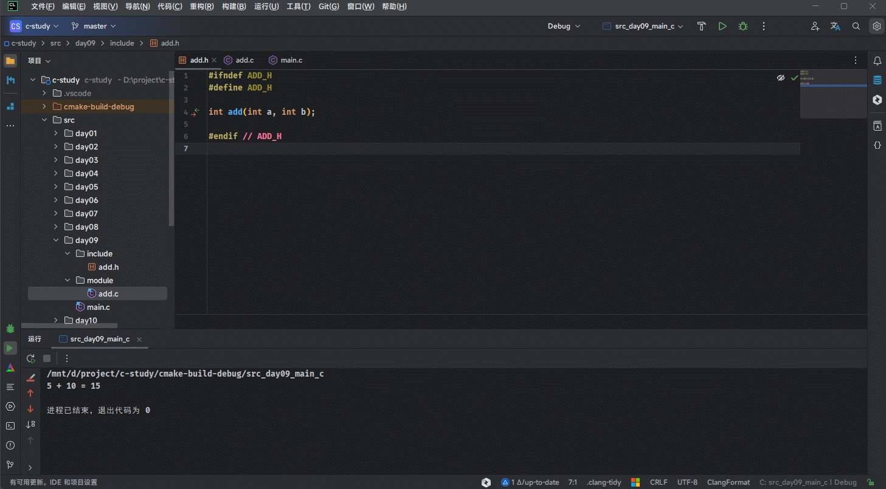

# 第一章：函数的基本概念

## 1.1 为什么需要函数？

* 我们小时候，可能玩过类似`《街霸》`或`《拳皇》`这样的游戏，如下所示：


* 在这些游戏中，假设角色的`出拳`、`出脚`、`跳跃`等动作都需要编写 50 - 80 行的代码。

> [!NOTE]
>
> * ① 或许，你会感觉每种角色`出拳`、`出脚`、`跳跃`等动作是不一样的，其背后的代码逻辑也应该是不一样的。
> * ② 其实，`出拳`、`出脚`、`跳跃`等动作只是 `UI` 方面的效果，这些动作背后对应的代码逻辑都是一样的（无非就是增减血量、增减蓝而已），不同的只是接收的参数！！！

* 如果我们在角色每次`出拳`、`出脚`、`跳跃`的地方都`重复的编写`这 50 - 80 的代码，这样程序就会编写很`臃肿`，`可读性`也非常`差`，如下所示：


* 为了解决代码`重复编写`的问题，我们可以将角色`出拳`、`出脚`、`跳跃`等动作的代码`提取`出来，放到一个 `{}`（代码块） 中，并为这个代码块起个名字。这样就可以在角色进行`出拳`、`出脚`、`跳跃`等动作的地方，通过这个`名字`来调用这个 `{}` 中的代码，如下所示：


* `没有使用函数`和`使用函数`的对比，如下所示：


> [!IMPORTANT]
>
> * ① 提取出来的代码可以看做是程序中定义的一个`函数`，程序在需要`出拳`、`出脚`、`跳跃`等地方调用该函数即可。
> * ② 函数只有`调用`的时候才会`执行`其内部的逻辑，不调用不执行！！！
> * ③ 将特定功能的代码封装为函数的好处： `实现代码重用`，`减少冗余`，`简化代码` 。

## 1.2 什么是函数？

* `函数`的`定义`：
  * `函数`是一种可以`重复使用`的`代码块`，用于执行特定的任务或操作。
  * `函数`允许我们将`代码逻辑`组织成`独立`的`单元`，从而提高了代码的`可读性`、`可维护性`以及`重用性`。
* 在 C 语言中，一个 C 程序可以由一个或多个源文件构成（C 文件扩展名是`“.c”`），一个源文件是一个编译单位。一个源文件可以由若干个函数构成，函数之间可以相互调用。也就是说，`函数是 C 程序基本的组成单位`，如下所示：


## 1.3 函数的作用

* ① `封装功能`：将一个完整的功能封装成函数，提高代码的结构化和复用性。

* ② `代码模块化`：将程序按照功能拆分成若干模块单元，有助于降低复杂度。
* ③ `增强可维护性`：如果需要修改某项功能，只需要调整对应的函数代码。
* ④ `隔离细节`：通过函数调用可以隐藏实现细节，只关心输入输出。

## 1.4 函数的分类

### 1.4.1 概述

* 从`不同的角度`看函数，有不同的分类方法。

### 1.4.2 从程序执行角度看

* 从程序的`执行`角度，函数可以分为`主函数`和`子函数`：
  * `主函数`：main() 函数。
  * `子函数`：非 main() 函数。

> [!NOTE]
>
> * ① 每个 C 语言应用有且仅有一个 main() 函数。
> * ② 无论主函数写在什么位置，C 程序总是从 main() 函数开始执行。
> * ③ main() 函数可以调用其它的子函数，子函数之间可以相互调用任意多次。

### 1.4.3 是否允许函数被外部文件调用角度看

* 从函数是否可以被`外部文件的函数调用`角度看，函数可以分为`内部函数`和`外部函数`：
  * `内部函数`：只能被当前源文件中的其他函数调用。
  * `外部函数`：不仅可以被当前源文件中的其他函数调用，还可以被其他源文件中的函数调用。

### 1.4.4 从用户使用角度看

* 从`用户使用`角度看，函数可以分为`库函数（标准函数）`和`自定义函数`：
  * `库函数（标准函数）`：它是由 C 系统提供的，用户不必自己定义，可直接使用它们。使用库函数，必须包含 `#include` 对应的头文件。
  * `自定义函数`：解决具体需求而自己定义的函数，需先定义再使用。

> [!NOTE]
>
> * ① C 语言标准仅仅是一个规范文件而言，不同的 C 语言编译系统，提供的库函数的数量和功能可能不一样。但是，基本的库函数是相同的。
>   
>   ::: details 点我查看 常见的 C 语言标准库函数
>   
>   * 字符串操作函数。
>   * 字符操作函数。
>   * 时间/日期函数。
>   * 数学函数。
>   * IO函数。
>   * 内存操作函数。
>   * 其它库函数。
>   
>   ::: 
> * ② 正是由于上述的特点，导致程序员在编写跨平台程序的时候，感觉非常麻烦。也倒逼了程序员开发了跨平台的工具，如：`CMake` 等。


# 第二章：函数的基本语法（⭐）

## 2.1 函数声明语法

* 语法：

```c
返回值类型 函数名(数据类型1 参数1,数据类型2 参数2,...){
    // 函数体
    return 返回值; 
}
```


* 示例：

```c
#include <stdio.h>

/**
 * 定义一个函数，计算两个整数的和，并返回
 * @param a 整数
 * @param b 整数
 * @return 和
 */
int add(int a, int b) {
    return a + b;
}

int main() {

    return 0;
}
```


* 示例：

```c
#include <stdio.h>

/**
 * 定义一个函数，获取两个整数的最大值，并返回
 * @param a 整数
 * @param b 整数
 * @return 最大值
 */
int max(int a, int b) {
    return a > b ? a : b;
}

int main() {

    return 0;
}
```


* 示例：

```c
#include <stdio.h>

/**
 * 打印两个整数的最大值
 * @param a 整数
 * @param b 整数
 */
void printMax(int a, int b) {
    int max = a > b ? a : b;
    printf("max = %d\n", max);
}

int main() {

    return 0;
}
```

## 2.2 声明函数语法的组成部分

### 2.2.1 概述

* 函数的声明语法分为：`返回值类型`、`函数名`、`参数列表`、`函数体`、`return 语句`。

```c
返回值类型 函数名(数据类型1 参数1,数据类型2 参数2,...){
    // 函数体
    return 返回值; 
}
```

* 其对应的图示，如下所示：


### 2.2.2 函数名

* `函数名`就是函数被调用时使用的名字，`函数名`就是`标识符`，需要遵循标识符的命名规则，并尽量做到见名知意，以增强程序的可读性。
* 在 C 语言中，函数名是函数的唯一标识，同一个文件中不允许两个同名的函数定义。

### 2.2.3 函数体

* `函数体`要写在大括号 `{}` 里面，是函数被调用后要执行的代码。
* 对于`调用者`来说，如果不了解函数体是如何实现的，也并不影响函数的使用。

### 2.2.4 返回值类型

* 函数调用后，是否需要在主函数（main 函数）中得到一个确定的、返回的值。针对这个返回值的描述，就是`返回值类型`。

> [!NOTE]
>
> * ① 返回值常常是一个计算的结果，或是用来作为判断函数执行状态的标记。
> * ② 函数按照`是否有返回值`来进行划分，函数可以分为`无返回值的类型的函数`和`有返回值类型的函数`。
>
> ::: details 点我查看 `无返回值的类型的函数`和`有返回值类型的函数`
>
> * ① `无返回值的类型`：
>   * 针对函数无返回值或明确不需返回值的情况，使用 `void` 表示。
>   * 例如：输出函数 `void printf(const char *format, ...)`。
> * ② `有返回值的类型`：
>   * 指明具体的类型，如：int、float、char 等。如果省略，默认为 int 类型。
>   * 例如：`int rand()`，调用后返回一个随机整数。
>
> :::

> [!CAUTION]
>
> * ① 如果返回值类型不是 void，并且函数中没有 return 语句，则函数会返回一个不确定的值。但从 C99 标准开始，这种做法已不再被支持。
> * ② C 语言不允许函数返回`数组`类型，是因为 C 语言设计时没有提供直接按值传递整个数组的机制（主要是出于效率和历史设计原因），而是采用指针来间接操作数组内容。


* 示例：无返回值类型的函数

```c {7-9}
#include <stdio.h>

/**
 * 定义一个没有返回值的函数
 * 其返回值类型是 void
 */
void printHelloWorld() {
    printf("Hello World");
}

int main() {

    // 禁用 stdout 缓冲区
    setbuf(stdout, nullptr);

    // 调用无返回值的函数
    printHelloWorld();

    return 0;
}

```


* 示例：有返回值类型的函数

```c {12-14}
#include <stdio.h>
#include <stdlib.h>
#include <time.h>
#include <unistd.h>

/**
 * 生成指定范围的随机数的函数
 * @param min
 * @param max
 * @return
 */
int randomInRange(int min, int max) {
    return rand() % (max - min + 1) + min;
}

int main() {

    // 禁用 stdout 缓冲区
    setbuf(stdout, nullptr);

    unsigned int seed = time(nullptr) ^ getpid(); // 使用时间和进程ID的组合

    srand(seed);

    // 定义范围
    int min = 1;
    int max = 100;

    // 生成并打印随机数
    for (int i = 0; i < 10; ++i) {`
        int random = randomInRange(min, max);
        printf("%d \n", random);
    }

    return 0;
}

```

### 2.2.5 参数列表

* 在定义函数时，函数名后面括号`()`中声明的变量称为形式参数，简称`形参`。

> [!NOTE]
>
> 根据`是否有参数`来进行划分，函数可以分为`无参函数`和`有参函数`。
>
> ::: details 点我查看 `无参函数`和`有参函数`。
>
> * ① `无参函数`：
>   * 在调用无参函数的时候，调用方不需要向被调用函数传递任何数据。
>   * 例如：立即终止函数 `abort()`，就不需要传递任何数据。 
> * ② `有参函数`：
>   * 在调用有参函数的时候，调用方需要向被调用函数传递数据，并且传递的数据称为实参（实际参数）。
>   * 例如：字符串比较函数 `strcmp(const char *str1, const char *str2)` 就需要传递两个字符串。
>
> :::


* 示例：无参函数

```c {6-13}
#include <stdio.h>

/**
 * 定义无参函数
 */
void printGraph() {
    for (int i = 0; i < 5; ++i) {
        for (int j = 0; j < 6; ++j) {
            printf("* ");
        }
        printf("\n");
    }
}

int main() {

    // 禁用 stdout 缓冲区
    setbuf(stdout, nullptr);

    // 调用无参函数
    printGraph();

    return 0;
}
```


* 示例：有参函数

```c {8-15}
#include <stdio.h>

/**
 * 定义有参函数
 * @param rows 行
 * @param cols 列
 */
void printGraph(int rows, int cols) {
    for (int i = 0; i < rows; ++i) {
        for (int j = 0; j < cols; ++j) {
            printf("* ");
        }
        printf("\n");
    }
}

int main() {

    // 禁用 stdout 缓冲区
    setbuf(stdout, nullptr);

    // 调用无参函数
    printGraph(5, 6);

    return 0;
}
```

### 2.2.6 return 语句

* return 语句的作用：
  * ① 结束函数的执行。
  * ② 将函数的结果返回给调用处。

> [!NOTE]
>
> * ① return 语句后面不要再写其它代码，否则会报错！！！
> * ② 如果返回值类型不是 `void` ，则函数体中必须保证有 `return 返回值;`语句，并且要求该返回值结果的类型和函数声明的返回值类型保持一致或兼容。
> * ③ 如果返回值类型是 `void`，函数体中可以没有 `return` 语句。如果要用 `return` 语句提前结束函数的执行，那么 return 后面不能加返回值，直接写 `return;` 即可。


* 示例：

```c {10,20,32}
#include <stdio.h>

/**
 * 定义一个函数，计算两个整数的和，并返回
 * @param a 整数
 * @param b 整数
 * @return 和
 */
int add(int a, int b) {
    return a + b;
}

/**
 * 定义一个函数，获取两个整数的最大值，并返回
 * @param a 整数
 * @param b 整数
 * @return 最大值
 */
int max(int a, int b) {
    return a > b ? a : b;
}

/**
 * 打印指定范围的数据。
 * 如果到了索引 5 ，则结束该函数的执行
 * @param start 起始索引
 * @param limit 结束索引
 */
void printNum(int start, int limit) {
    for (int i = start; i <= limit; i++) {
        if (i % 5 == 0) {
            return; // 用于提前结束函数的执行
        }
        printf("i = %d\n", i);
    }
}

int main() {

    int a = 10;

    int b = 20;

    printf("a + b = %d\n", add(a, b));

    printf("a 和 b 的最大值 = %d\n", max(a, b));

    printNum(1, 10);

    return 0;
}
```

### 2.2.7 声明函数的注意事项

* ① C 语言中所有的函数都是独立执行的。一个函数并不从属于另一个函数，即：函数不能嵌套定义。

> [!NOTE]
>
> ::: details 点我查看 `类 C 的编程语言`和`函数式编程语言`对`函数嵌套`的支持
>
> * ① 类 C 的编程语言（C、C++、Java 等）通常不支持函数的嵌套，即：在一个函数内部定义另一个函数。这种设计简化了编译过程，但也限制了某些编程风格。如果需要类似的功能，可以通过使用回调函数或将函数指针作为参数来实现。
> * ② 函数式编程语言（Lisp、JavaScript 等）通常支持函数嵌套，即：在一个函数内部定义另一个函数。嵌套函数可以访问其外部函数的作用域中的变量，增强了封装性和可读性。这种特性有助于实现更复杂的逻辑而不污染全局命名空间。
>
> :::

```c
#include <stdio.h>

// 错误演示
void fun1(int a,int b){ // [!code error]
    ... // [!code error]
    void fun2(int c,int d){ // [!code error]
       ...  // [!code error]
    } // [!code error]
} // [!code error]

int main() {


    return 0;
}

```

* ② 在 C 语言中，不允许同名函数有不同参数列表，`函数名用来唯一标识一个函数`，即：在 C 语言中，函数不能重载。

> [!NOTE]
>
> ::: details 点我查看 不同编程语言对`函数重载`的支持
>
> * ① C 语言不支持函数重载。
> * ② C++、Java 等编程语言是支持函数重载的。
>
> :::

```c
#include <stdio.h>

// 错误演示
int add(int a, int b) { // [!code error]
    return a + b; // [!code error]
} // [!code error]

// 错误演示
int add(int a, int b, int c) { // [!code error]
    return a + b + c; // [!code error]
} // [!code error]

int main() {

    return 0;
}

```

## 2.3 调用函数

* 语法：

```c
函数名(实参1,实参2,...); // 调用没有返回值的函数
```

```c
数据类型 变量名 = 函数名(实参1,实参2,...); // 调用有返回值的函数
```

> [!NOTE]
>
> * ① 调用函数的时候，实际参数的个数必须和函数的形式参数个数一致，不能多也不能少；否则，将会报错！！！
> * ② 子函数可以相互调用，但是不能调用 main() 函数，因为 main() 函数是被操作系统调用的，作为程序的启动入口。反之，main() 函数可以调用其它函数。
> * ③ 函数的参数和返回值类型，会根据需要进行自动类型转换。


* 示例：

```c {10}
#include <stdio.h>

void fun1() {
    printf("呵呵哒\n");
}

int main() {

    // 调用无返回值函数
    fun1();
    
    return 0;
}

```


* 示例：

```c {13}
#include <stdio.h>

int add(int a, int b) {
    return a + b;
}

int main() {

    int a = 1;
    int b = 2;

    // 调用有返回值函数
    int result = add(a, b);

    printf("a +b = %d\n", result);

    return 0;
}
```

## 2.4 应用示例

* 需求：编写程序，声明一个函数，在函数中获取两个整数的最大值。


* 示例：

```c
#include <stdio.h>

/**
 * 获取两个整数的最大值
 * @param a 整数
 * @param b 整数
 * @return 最大值
 */
int max(int a, int b) {
    return a > b ? a : b;
}

int main() {

    int a = 1;
    int b = 2;

    int maxValue = max(a, b);

    printf("a 和 b 的最大值是：%d\n", maxValue);

    return 0;
}
```

## 2.5 应用示例

* 需求：编写程序，声明两个函数，在函数中获取两个整数或三个整数的最大值。


* 示例：

```c
#include <stdio.h>

/**
 * 获取两个整数的最大值
 * @param a 整数
 * @param b 整数
 * @return 最大值
 */
int max(int a, int b) {
    return a > b ? a : b;
}
/**
 * 获取三个整数的最大值
 * @param a 整数
 * @param b 整数
 * @param c 整数
 * @return 最大值
 */
int triMax(int a, int b, int c) {
    return max(max(a, b), c);
}

int main() {

    int a = 1;
    int b = 2;

    printf("a 和 b 的最大值是：%d\n", max(a, b));

    int c = 10;

    printf("a, b 和 c 的最大值是：%d\n", triMax(a, b, c));

    return 0;
}
```

## 2.6 应用示例

* 需求：编写程序，声明一个函数，在函数中获取 1 + 2 ... + n 的结果。


* 示例：

```c
#include <stdio.h>

/**
 * 获取 1+2+...+n 的和
 * @param n
 * @return
 */
int getSum(int n) {
    int sum = 0;
    for (int i = 1; i <= n; i++) {
        sum += i;
    }
    return sum;
}

int main() {

    int result = getSum(10);
    printf("%d\n", result);

    return 0;
}
```

## 2.7 应用示例

* 需求：编写程序，验证哥德巴赫猜想。

> [!NOTE]
>
> * ① 哥德巴赫猜想：任一大于 2 的偶数都可写成两个素数之和。
> * ② 质数：只能被 1 或其本身整除的自然数，如：2、3、5...


* 示例：

```c
#include <math.h>
#include <stdio.h>

/**
 * 判断某个数是否是质数（只能被 1 或其本身整除的自然数，如：2、3、5...）
 * 判断方法：[2,num-1] 范围内没有其它约数
 * @param num
 * @return
 */
bool prime(int num) {
    if (num <= 1) {
        return false;
    }

    // 判断 [2,num-1] 范围内没有其它约数
    // for (int i = 2; i < num; i++) {
    for (int i = 2; i <= sqrt(num); i++) { // 优化
        // 如果 num 能被 i 整除，说明 num 不是质数
        if (num % i == 0) {
            return false;
        }
    }

    return true;
}

/**
 * 哥德巴赫猜想：任何一个大于 2 的偶数都可以写成两个质数之和
 * @param num
 * @return
 */
bool guess(int num) {
    bool flag = false;

    for (int i = 2; i < num; ++i) {
        if (prime(i) && prime(num - i)) {
            flag = true;
            break;
        }
    }

    return flag;
}

#define BOOL_TO_STRING(x) ((x) ? "true" : "false")

int main() {

    // 禁用 stdout 缓冲区
    setbuf(stdout, nullptr);

    int num = 0;

    while (true) {
        if (num > 2 && num % 2 == 0) {
            break;
        }
        printf("请输入一个大于 2 的偶数：");
        scanf("%d", &num);
    }

    printf("哥德巴赫猜想正确? %s\n", BOOL_TO_STRING(guess(num)));

    return 0;
}
```


# 第三章：进一步认识函数

## 3.1 main() 函数（主函数）

### 3.1.1 主函数的作用

* ① 主函数是程序的入口函数，即：所有的程序一定要包含一个主函数，程序总是从这个函数开始执行，如果没有该函数，程序就无法启动。
* ② 主函数中可以调用其它函数，但其它函数不能反过来调用主函数，主函数也不能调用自己。

### 3.1.2 主函数的返回值

* 主函数的一般格式：

```c
int main(){
    
    ...
        
    return 0;
}
```

* C 语言约定，主函数返回值 `0` ，表示运行`成功`；如果返回其它`非零`整数，就表示运行`失败`。

> [!TIP]
>
> * ① 默认情况下，如果主函数里面省略 `return 0` 这一行，编译器会自动加上，即 main() 的默认返回值为 0。
> * ② 建议书写时保留 `return` 语句，以便形成统一的代码风格。

### 3.1.3 主函数的其它写法

#### 3.1.3.1 概述

* 主函数的声明中是可以携带两个参数，格式如下所示：

```c
/**
* @param argc（argument count）参数的个数
* @param argv（argument value）字符串的指针数组
*/
int main(int argc, char *argv[]) {
   //函数体
}
```

> [!NOTE]
>
> * ① 通过这种方式，我们可以在命令行中将指定的字符串参数传递到 C 程序中，以便进行下一步处理。
> * ② 在实际开发中，很少使用，了解即可！！！


* 示例：

```c {3}
#include <stdio.h>

int main(int argv, char *argc[]) {

    for (int i = 0; i < argv; ++i) {
        char *args = argc[i];
        printf("%s\n", args);
    }

    return 0;
}
```

#### 3.1.3.2 CLion 调试

* 如果是 CLion 进行调试，在 `编辑配置` --> `程序实参` 处，填写想要的实际参数即可。


#### 3.1.3.3 命令行调试

* 如果是命令行进行调试，通过 gcc 命令编译之后，只需要在程序启动时加上参数。

```shell
gcc demo.c -o demo
```

```shell
./demo a b c d
```


## 3.2 exit() 函数（了解）

* `exit()` 函数的声明，如下所示：

```c
void exit (int status);
```

> [!NOTE]
>
> * ① `exit()` 函数是用于终止程序执行的标准库函数。一旦执行到该函数，程序就会立即结束。
> * ② `exit()` 函数的`原型`（函数原型是什么？下文见！！！）定义在头文件 `stdlib.h` 中，主要用于在程序执行过程中提前退出。

* `exit()` 函数本身不会直接向程序返回值，但它会将提供的`状态码`传递给操作系统：
  * 如果 `status` 为 `0`（EXIT_SUCCESS，常量） ，则表示程序运行成功，正常结束。
  * 如果 `status` 为`非 0` （EXIT_FAILURE，常量），则表示程序异常中止。
* 这个状态码可以在命令行或父进程中被访问，以指示程序的退出状态（在 `shell` 中，可以使用 `$?` 来获取上一个执行命令的退出状态）。

> [!NOTE]
>
> ::: details 点我查看 `exit()` 函数的执行过程
>
> * ① `清理操作`：在退出程序之前，`exit` 会先调用所有注册的 `atexit` 函数。这些函数通常用于释放资源或进行清理操作。
> * ② `关闭文件流`：如果有打开的文件流，`exit` 会确保它们被正确关闭。
> * ③ `返回控制`：程序的控制权返回给操作系统。
>
> :::

> [!NOTE]
>
> * ① 当 `main` 函数返回时，编译器会自动调用 `exit`，传递 `main` 函数的返回值作为 `exit` 的参数。
> * ② 换言之，如果 `main` 函数返回 `0`，相当于调用了 `exit(0)`。
> * ③ 这意味着在 `main` 函数结束后，系统会执行与直接调用 `exit` 相同的清理操作，包括：`清理操作`、`关闭文件流`和`返回控制`。

> [!CAUTION]
>
> * ① 使用 `exit` 会立即终止程序，而不会执行 `main` 函数中的剩余代码。
> * ② 应谨慎使用 `exit`，尤其是在大型程序中，因为它可能会影响程序的可维护性和调试。
> * ③ 在多线程程序中，调用 `exit` 会终止整个程序，而不仅仅是调用 `exit` 的线程。


* 示例：

```c {10}
#include <stdio.h>
#include <stdlib.h>

int main() {
    printf("This is a simple program.\n");

    // 进行某种检查
    if (1) { // 假设条件为真
        printf("Exiting the program.\n");
        exit(0); // 正常退出
    }

    printf("This line will not be executed.\n");
    return 0;
}
```

## 3.3 atexit() 函数（了解）

* atexit() 函数的声明，如下所示：

```c
int atexit (void (*func) (void))
```

> [!NOTE]
>
> * ① 当程序正常终止时，所有通过 `atexit` 注册的函数都会按照注册的相反顺序（即 LIFO，后进先出）依次执行。
> * ① func 参数是一个指向无参数、无返回值的函数的指针。也就是说，`func` 是一个不接受任何参数并且返回 `void` 的函数。
> * ② `atexit` 函数返回 `0` 表示注册成功，返回非零值表示注册失败。

> [!CAUTION]
>
> * ① 通过 `atexit` 注册的函数只会在程序`正常终止`时被调用。如果程序异常终止（通过 `abort` 函数终止，或者遇到未处理的严重错误如分段错误），则这些函数不会被调用。
> * ② `atexit` 函数最多可以注册 `32` 个清理函数（具体数量依赖于实现）。
> * ③ `atexit` 机制非常有用，尤其是在需要确保某些资源（文件句柄或动态内存）在程序结束时被正确释放的情况下。


* 示例：

```c
#include <stdio.h>
#include <stdlib.h>

void cleanup1(void) {
    printf("清理1....\n");
}

void cleanup2(void) {
    printf("清理2....\n");
}

int main() {

    printf(".... main ....\n");

    atexit(cleanup1);
    atexit(cleanup2);

    printf(".... main ....\n");

    return 0;
}
```

## 3.4 函数原型（⭐）

### 3.4.1 概述

* 默认情况下，函数必须先声明，再使用。由于程序总是先运行 main() 函数，导致其它的函数都必须在 main() 函数之前声明。

```c {4,9,16,19}
#include <stdio.h>

// 声明函数
void fun1() {
    // ...
}

// 声明函数
void fun2() {
    // ...
}

int main() {

    // 调用函数
    fun1();
    
    // 调用函数
    fun2();
    
    return 0;
}
```

* 如果将 `fun1()` 的函数声明和 `fun2()` 的函数声明放在 main() 函数的后面，就会产生编译错误，即：找不到 `fun1()` 和 `fun2()` 的声明。

```c
#include <stdio.h>

int main() {

    // 调用函数
    fun1();

    // 调用函数
    fun2();

    return 0;
}

// 声明函数
void fun1() {
    // ...
}

// 声明函数
void fun2() {
    // ...
}
```

* 在 CLion 中，会直接报错，如下所示：

> [!NOTE]
>
> ::: details 点我查看 CLion 中的使用技巧
>
> 本人是在 CLion 中安装了 `Inspection Lens` 插件，所以警告、报错信息，会直接在代码旁边显示，非常实用！！！
>
> 
>
> :::


* 对于函数较多的程序，保证每个函数的正确顺序，会变得极其麻烦。C 语言提供的解决方案是：只要在程序开头处给出`函数原型`，函数就可以先使用，再声明。

> [!NOTE]
>
> 函数原型到底是什么？随后讲解！！！

```c
#include <stdio.h>
// 函数原型
void fun1();

// 函数原型
void fun2();

int main() {

    // 调用函数
    fun1();

    // 调用函数
    fun2();

    return 0;
}

// 声明函数
void fun1() {
    // ...
}

// 声明函数
void fun2() {
    // ...
}
```

* 到此为止，CLion 中将不会报错，如下所示：


### 3.4.2 函数原型

* 所谓的`函数原型`（Function Prototype）就是函数在调用前告诉编译器每个函数的基本信息，包括：`返回值类型`、`函数名`、`函数个数`、`参数类型`和`参数顺序`。并不需要包括函数体和参数名称。在程序编译的时候，只要检查函数原型和函数声明是否一致，如果一致就可以正确的编译。

> [!NOTE]
>
> * ① 尽管`函数原型`中包含参数名是多余的，但是对阅读代码是有帮助的，建议在定义函数原型的时候，加上参数名。
> * ② 如果学过 `Java` 语言，可以将`函数原型`理解为 `JDK8` 之前的`接口`。

```c {4}
#include <stdio.h>

// 等价于 int add(int num1,int num2);
int add(int, int); // 函数原型

int main() {

    int a = 10;
    int b = 20;

    printf("a + b = %d\n", add(a, b));

    return 0;
}

// 函数实现
int add(int a, int b) {
    return a + b;
}
```

* 如果你还不理解，那么让我们回顾一下，C 程序的编译过程：


* 我们在入门程序中，是这么写的，如下所示：

```c
#include <stdio.h>

int main() {

    printf("你好，世界");

    return 0;
}
```

* `printf` 函数并不是我们写的，它是一个标准库函数，它的头文件是 `stdio.h`，内容如下：

```c
// ... 其余内容省略
extern int printf (const char *__restrict __format, ...);
// ... 其余内容省略
```

* 我们可以看到 `stdio.h` 中，并没有 `printf` 函数的实现，即：`printf` 只有`函数原型`，而没有具体的`函数实现（函数体）`。在 C 语言进行`预处理`的时候，会将 `stdio.h` 中的所有内容复制到源文件（还有`宏展开`、`条件编译`、`删除注释`等过程），再经过`编译`和`汇编`，并进行`链接`。

> [!NOTE]
>
> 如果以 `printf` 函数为例，所谓的链接就是通过链接器将 `printf` 函数的实现（glibc 提供的）编译到最终的二进制文件中。

## 3.5 多文件编译

### 3.5.1 头文件的作用

* 我们不难发现，`标准库`就是将`函数原型`定义在`头文件`中的，那么我们也应该将`自定义函数`的`函数原型`定义在`头文件`中，这样方便管理，而将`自定义函数`的`实现`放在 `.c` 文件中。

> [!CAUTION]
>
> * ① 在实际开发中，我们是使用  `#include <xxx.h>` 将`标准库`函数的`头文件`引入到工程中。
> * ② 在实际开发中，我们是使用 `#include "xxx.h"`将`自定义`函数的`头文件`引入到工程中。

* 如果你用的是我之前给出的 `CMakeLists.txt`，那么项目的工程目录是这样的，如下所示：

```txt
├─📁 include/---- # 头文件目录
│ └─📄 add.h
├─📁 module/----- # 函数实现目录
│ └─📄 add.c
└─📄 main.c------ # 主函数
```

* 在 CLion 中，是这样的，如下所示：


* 对于 `include/add.h` 文件，其内容如下：

```c [include/add.h]{5}
#ifndef ADD_H
#define ADD_H

// 函数原型
int add(int a, int b);

#endif // ADD_H
```

* 对于 `module/add.c` 文件，其内容如下：

```c [module/add.c] {1,4-6}
#include "./include/add.h" // 导入自定义函数的头文件

// 函数声明或函数实现
int add(int a,int b) {
  return a + b;
}
```

* 对于 `main.c` 文件，其内容如下：

```c [main.c] {1,2,9}
#include <stdio.h> // 导入标准库函数的头文件
#include "./include/add.h" // 导入自定义函数的头文件

int main() {

    int a = 5;
    int b = 10;

    int result = add(a, b);
    printf("%d + %d = %d\n", a, b, result);

    return 0;
}
```

* 可以在 CLion 中试着运行，看是否能正确运行：


### 3.5.2 头文件重复

#### 3.5.2.1 概述

* 我们也知道，对于 C 语言的`预处理`而言，只会将对应的`头文件`的内容都插入到源文件中。这样会导致一个问题：有可能头文件会在很多 `.c` 文件中都导入过，这样有可能会导入`两遍`甚至更多。
* 我们可以使用一个案例来验证，目录结构如下所示：

```txt
├─📁 include/---- # 头文件目录
│ ├─📄 add.h
│ └─📄 sub.h
├─📁 module/----- # 函数实现目录
│ ├─📄 add.c
│ └─📄 sub.c
└─📄 main.c------ # 主函数
```

* 其对应的图示，如下所示：


* 对于 `include/add.h` 文件，其内容如下：

```c [include/add.h]
int add(int a, int b);
```

* 对于 `include/sub.h` 文件，其内容如下：

```c [include/sub.h]
int sub(int a, int b);
```

* 对于 `module/add.c` 文件，其内容如下：

```c [module/add.c]
#include "../include/add.h"

int add(int a, int b) { 
    return a + b; 
}
```

* 对于 `module/sub.c` 文件，其内容如下：

```c [module/sub.c]
#include "../include/sub.h"

int sub(int a, int b) { 
    return a - b; 
}
```

* 对于 `main.c` 文件，其内容如下：

```c [main.c] {3-4}
#include <stdio.h>

#include "./include/add.h"
#include "./include/add.h"
#include "./include/sub.h"

int main() {
  int a = 5;
  int b = 10;

  int result = add(a, b);
  printf("%d + %d = %d\n", a, b, result);

  result = sub(a, b);
  printf("%d - %d = %d\n", a, b, result);

  return 0;
}
```

* 使用 `gcc` 命令来进行预处理，如下所示：

```shell
gcc -E main.c -o main.i
```


* 其工程对应的逻辑结构，如下所示：


#### 3.5.2.2 解决头文件重复

* 头文件重复并不会对程序的执行造成什么影响。但是，可能会增加编译时间。
* 那么，如何防止头文件重复包含，C 语言给出了两种解决方案：
  * `方案①`：在`头文件`最顶行加上 `#pragma once`。
  * `方案②`：在`头文件`中使用 `#ifndef #define #endif`。

* 使用`方案①` 解决头文件重复包含，那么  `include/add.h` 和 `include/sub.h` 的内容如下：

```c [include/add.h] {1}
#pragma once

int add(int a, int b);
```

```c [include/sub.h] {1}
#pragma once

int sub(int a, int b);
```

* 使用 `gcc` 命令来进行预处理，如下所示：

```shell
gcc -E main.c -o  main.i
```


* 使用`方案②` 解决头文件重复包含，那么  `include/add.h` 和 `include/sub.h` 的内容如下：

```c [include/add.h] {1-2,6}
#ifndef ADD_H
#define ADD_H

int add(int a, int b);

#endif // ADD_H
```

```c [include/sub.h] {1-2,6}
#ifndef SUB_H
#define SUB_H

int sub(int a, int b);

#endif // SUB_H
```

* 使用 `gcc` 命令来进行预处理，如下所示：

```shell
gcc -E main.c -o  main.i
```


* CLion 的快捷方式是采用`方案①`来解决头文件包含问题，如下所示：

> [!NOTE]
>
> CLion 支持`方案①`和`方案②`，只不过`方案①`有对应的模板文件而已！！！



